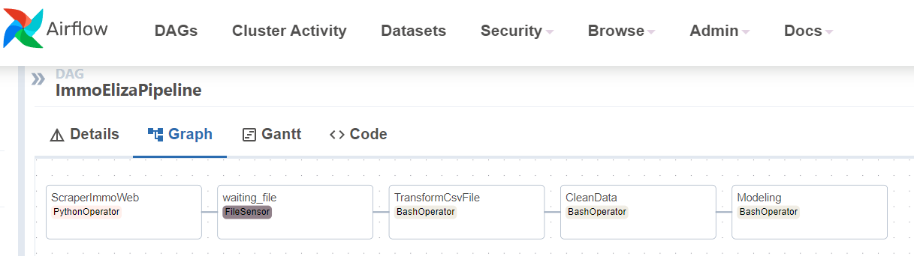

# Immo Eliza - Pipeline

A solo project @ [BeCode.org](https://becode.org/) as part of the **AI Bootcamp** in Gent

## Project description

This project is created with the purpose of automating the scraper, cleaning, model analysis and prediction processes of the previous project [Immo Eliza](https://github.com/mendoce24/immo-eliza-data-analysis).

This is a project to create a Machine Learning (ML) model to predict sell prices of real estate properties in Belgium.

The dataset used a `csv` file scraped from [ImmoWeb](https://www.immoweb.be/en) website.

## Installation

1. Clone [Immo Eliza Pipeline](https://github.com/mendoce24/immo-eliza-pipeline) repository
2. Change directory to the root of the repository
3. Install required libraries by running `pip install -r requirements.txt`
4. This project uses a Docker container which you can install with the following command `docker-compose up`

## Usage
- As it is a project implemented in airflow, it will be fully automated and will run at night capturing the information and processing it.

## Timeline

The stage of the project lasted 5 days in the week of September 18-22, 2023.

## The Team

The stage was made by:

- César E. Mendoza V. [LinkedIn](https://www.linkedin.com/in/mendoce24/) | [GitHub](https://github.com/mendoce24)

## Instruction

The stage was made under the supervision of [Vanessa Rivera Quiñones](https://www.linkedin.com/in/vriveraq/) and [Samuel Borms](https://www.linkedin.com/in/sam-borms/?originalSubdomain=be)

Gent | September 22, 2023
